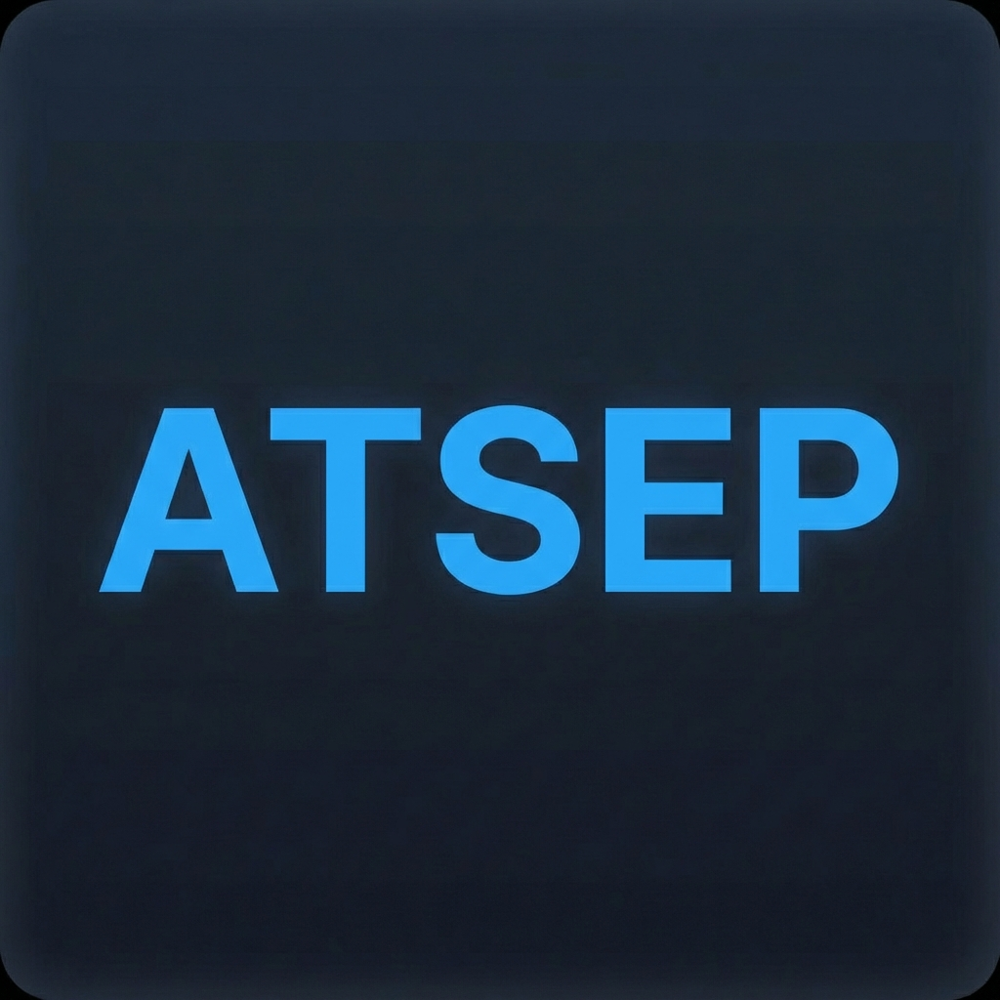

# ATSEP Toolbox

**ATSEP Toolbox** is a comprehensive Progressive Web App (PWA) designed for ATC Engineers and aviation professionals. It combines QNH correction with high-accuracy geodesic tools.

## Features

### 1. QNH Correction Calculator

* **Standards Compliant:** Calculates QNH corrections in line with the *Manual of the ICAO Standard Atmosphere (DOC7488/3)*.
* **Persistent:** Remembers your pressure units and preferences.

### 2. Geodesic Tools (High Accuracy)

Use **Vincenty's Algorithms** on the WGS-84 ellipsoid, providing distance and bearing accuracy to within a few millimeters (vs ~0.5% error in spherical models).

* **Range (Inverse):** Calculate the distance and initial bearing between two points.
* **Destination (Direct):** Project a new point given a starting point, distance, and bearing.
* **Linked Units:** Seamlessly switch between Nautical Miles (NM) and Meters (M) across tabs.
* **Flexible Formatting:** Support for Decimal Degrees (DD), Degrees Decimal Minutes (DDM), and DMS.

## Usage

The application is a **Progressive Web App (PWA)**.

* **Online:** Visit the hosted page.
* **Offline:** Install it to your home screen on iOS or Android to use it anywhere, even without an internet connection.

---

Currently available at: <https://arnaudamiel.github.io/ATSEP-Toolbox/ATSEP.html>

---

Github repo: <https://github.com/arnaudamiel/ATSEP-Toolbox>
